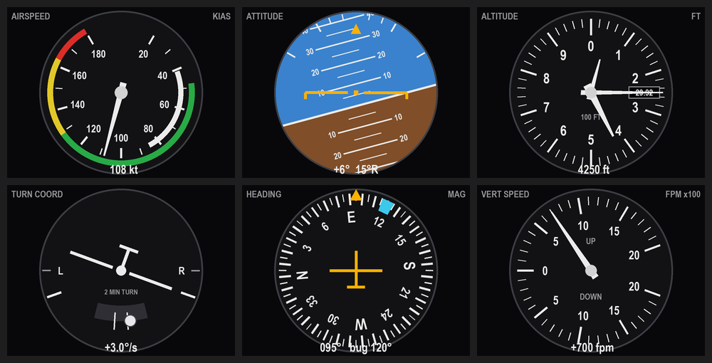

# saitek-fip-macos

**A Saitek / Logitech Flight Instrument Panel driver for macOS — the classic
six-pack, live from X-Plane 12.**

Logitech never shipped a Mac driver for the Pro Flight Instrument Panel. The
Windows one — DirectOutput, last updated in 2018 — is the only software that
ever spoke to it, and Logitech's own support page is explicit that the panels
are the exception to Mac compatibility: *"Other than Pro Flight Panels, all
other products in the Pro Flight and Farm Sim ranges are compatible with Mac OS
X 10.10.x or later as basic Plug and Play HID devices"*
([source](https://support.logi.com/hc/en-ch/articles/360023347393-Mac-support-for-Saitek-devices)).
So the panel sits in a drawer.

This drives it directly. No kernel extension, no DirectOutput service, no
X-Plane plugin.



```
X-Plane 12  --UDP 49000-->  fipx  --USB bulk-->  FIP screen
                             ^                   FIP keys and knobs
                             +---USB HID---------+
```

Why this is possible at all: the FIP's display lives on a **vendor-class** USB
interface, and macOS binds no driver to a vendor-class interface — so libusb
can claim it with no root and no kext. The buttons are a separate, ordinary HID
interface, which we read the supported way through hidapi rather than trying to
wrestle it away from the kernel. And X-Plane has published a UDP dataref
protocol for years, so the simulator side needs no plugin either.

## Requirements

* A Mac (Apple Silicon or Intel). Developed on macOS 15; older versions
  should work but are untested
* [Homebrew](https://brew.sh), for `libusb` and `hidapi`
* Python 3.9 or newer (developed on 3.14)
* X-Plane 12, with **Settings ▸ Network ▸ Accept incoming connections** on
  (it is on by default)
* A Saitek / Logitech Pro Flight Instrument Panel, USB `06a3:a2ae`

## Install and run

```
git clone https://github.com/YOU/saitek-fip-macos.git
cd saitek-fip-macos
./run.command
```

`run.command` installs the two Homebrew libraries, builds a virtualenv, and
starts the driver. It is double-clickable from Finder. By hand:

```
brew install libusb hidapi
python3 -m venv .venv && .venv/bin/pip install pyusb pillow hid
.venv/bin/python fipx.py run
```

Start order doesn't matter. The panel reads `NO DATA FROM X-PLANE` until the
sim answers, re-subscribes until it does, and recovers if X-Plane restarts. If
you have just launched X-Plane, expect a blank half-minute while it loads the
flight — it accepts UDP before it starts replying.

| command | what it does |
|---|---|
| `fipx.py run` | the six-pack, live from the sim |
| `fipx.py run --demo` | synthetic flight — checks the panel without X-Plane |
| `fipx.py run --xp-host 192.168.1.50` | X-Plane on another machine |
| `fipx.py test` | find the panel, show a test card, echo key presses |
| `fipx.py calibrate` | learn which key is which, prompting on the panel itself |
| `fipx.py contact-sheet` | render every gauge to PNG, no hardware needed |

Also: `--rate` frames per second (default 25), `--page 0-5` which instrument to
start on, `--serial` to pick one panel if you own several, `--verbose` for
frame-rate and USB statistics.

## The controls

| control | does |
|---|---|
| soft keys 1–6 | airspeed, attitude, altimeter, turn coordinator, heading, vertical speed |
| left knob | step through the instruments |
| right knob | on the altimeter, sets the Kollsman window; on the attitude and heading gauges, moves the heading bug |

The knobs write back into the sim, so turning the right knob on the altimeter
really does re-set the altimeter in X-Plane.

**Run `fipx.py calibrate` once.** The default key map is correct for the panel
this was developed on, but the knob *directions* are a guess, and yours may
differ. Calibrate asks for each control in turn, prompting on the panel's own
screen, and saves the result to `~/.config/fipx/buttons.json`.

## The instruments

* **Airspeed** — the arcs are built from the loaded aircraft's own V-speeds, so
  the dial re-scales when you change aircraft. A 172 gets a 40–180 kt face with
  a caution arc; a jet gets a wider one and no yellow.
* **Attitude** — pitch ladder and bank scale.
* **Altimeter** — three pointers and a Kollsman window.
* **Turn coordinator** — rate of turn differentiated from heading and smoothed,
  so it reads a true 3°/sec at the standard-rate marks in any aircraft; the ball
  comes from `slip_deg`.
* **Heading** — rotating card with a heading bug.
* **Vertical speed** — ±2000 fpm, or ±6000 for something fast.

Attitude and heading come from whichever gyro group the aircraft actually
models — vacuum, electric or AHARS — falling back to the flight model. An
aircraft that models none of them reads a flat zero forever otherwise. A
consequence worth knowing: with vacuum gyros the attitude and heading
indicators stay dead until the engine is running, exactly as they should.

## If it doesn't work

* **"no Saitek FIP found"** — check it is plugged in and lit. `fipx.py test`
  lists what it can see.
* **"could not claim the FIP data interface"** — something else already has it.
  Quit any other copy of the driver.
* **Buttons don't register but the display works** — they are two separate USB
  interfaces, so one can work without the other. Run `fipx.py calibrate`.
* **The panel wedges after a crash** — it isn't broken. The device keeps state
  across processes, and a program that dies mid-transfer leaves it refusing
  commands. The driver issues a USB reset when it opens the panel, which clears
  that without unplugging anything.
* **"NO DATA FROM X-PLANE"** — the sim isn't answering. Check Settings ▸
  Network ▸ Accept incoming connections, make sure a flight is actually loaded,
  and pass `--xp-host` if X-Plane is on another machine.

---

# How this was built

Nobody publishes this protocol. Here is where the information came from, what
had to be worked out, and how each piece was checked — both to give credit and
so the next person doesn't start from nothing.

## What already existed

**[EasyNetDev/Saitek-FIP](https://github.com/EasyNetDev/Saitek-FIP)** is the
reason this project was a weekend rather than a month. That repository contains
no source code — a README and a photograph — but its author did the one step
that is genuinely hard to repeat: they ran Logitech's Windows DirectOutput
service under a USB capture, pulled the packets out with Wireshark and
`tshark`, and wrote down what the driver actually sends.

Four facts came from that README, and only those four:

1. The display is driven over **bulk USB**, not HID, on device `06a3:a2ae`.
2. Two literal 44-byte command strings, in hex, with the replies they expect —
   a handshake and an "image incoming" command.
3. The image payload is the **body of a 24bpp BMP with the header removed**,
   320 × 240 × 3 = 230400 bytes.
4. **No firmware upload is required.** DirectOutput is not a driver at all, just
   a service that pokes USB endpoints.

That last one was make-or-break. Plenty of devices in this class need a
firmware blob extracted from a Windows installer and pushed on every plug-in,
and if the FIP had been one of them this project would have looked very
different.

Nothing else existed to build on. There is no Mac driver for this device, open
or otherwise, and no code in that repository to fork.

## What had to be worked out here

Everything below was derived from the device itself, on macOS.

**That macOS could work at all.** Dumping the descriptors with `ioreg` showed
the FIP exposes two interfaces: interface 0 is HID, which macOS claims, and
interface 1 is **vendor-class, named "Saitek FIP Data Pipes"**. macOS binds no
driver to a vendor-class interface, which is precisely why libusb can take it
without root or a kernel extension. That is the fact the whole port rests on
and it appears in no documentation. The same dump gave the real endpoint
addresses — `0x02` OUT and `0x81` IN — settling a contradiction in the source
README, which said `0x82` in one paragraph and `0x81` in another, and confirmed
the device is USB high-speed, which set the frame-rate budget.

**The command structure.** The inherited material was two opaque hex blobs. In
them, `0x038400` = 230400 sits at bytes 9–11 as a big-endian length, the two
commands differ only at byte 23 (`0x0a` handshake, `0x06` image), and byte 7 is
a page number. The driver therefore *builds* its headers from that structure
rather than replaying captured bytes, and asserts at import that the builder
reproduces both captured strings exactly — a decoding of a capture is a theory
until something checks it.

**The pixel layout.** The source README said "RGB" in prose but "BMP body" in
practice, and those disagree: BMP pixel data is BGR, bottom row first. Settled
empirically by pushing a deliberately asymmetric test card labelled `1 TOP RED`
/ `3 LOW BLUE` / `<< LEFT` / `RIGHT >>` and looking at the panel. It came up
inverted with the colours correct and `<< LEFT` still on the left, which
confirms BGR, proves the rows are flipped, and rules out a 180° rotation — all
three at once, which a top-and-bottom-only test card could not have done.

**The buttons and knobs, from scratch** — the inherited material says nothing
about input. The HID report descriptor, pulled from `ioreg` and parsed by hand,
asks for twelve one-bit buttons in a two-byte report. That immediately explains
the knobs: they are not axes, so each detent arrives as a momentary press of a
direction bit and a knob is read by counting rising edges. The actual bit
assignment came from pressing every control and watching: soft keys are bits
0–5 in order, the left knob is 6/7, and the right knob is **10/11** — bits 8
and 9 never fire, which is not what the obvious guess would be.

**Throughput.** Handing libusb the whole 230 KB frame in one bulk write runs at
43 fps; splitting it into 512-byte packets yourself, as the capture showed
DirectOutput doing, halves that. Measured, not assumed.

**The failure mode.** About 1% of frames return `errno 5`. Instrumenting each
stage separately over 400 frames showed the failure is almost always the *ack
read*, not the pixel transfer — by which point the image has already been
delivered and drawn. So the driver clears the input endpoint and carries on
instead of resending a picture the panel is already showing. Diagnosing that
also turned up the startup problem behind it: a failed transfer can leave an
unread status packet queued, so the next handshake reads the *previous* frame's
reply and the request/reply pairing slips by one. The fix is to drain the
endpoint before every handshake.

**Recovering a wedged panel.** The source README notes that the device stops
answering if it isn't shut down properly, and that the deinitialisation
commands were not yet understood. A USB reset on open turns out to clear it
completely, which is why you never have to unplug anything.

## How it was checked

Reverse-engineered protocol claims are worth nothing unless something tests
them, so each one has a check behind it:

* the header builder **asserts** it reproduces both captured command strings
  byte-for-byte, and the panel returns the documented ack byte-for-byte
* the attitude indicator was verified **numerically**, not by eye — sampling
  the rendered horizon confirms 3.0 px per degree, linear across ±20°, with
  nose-up putting the horizon down and a right bank lifting the right side
* the turn coordinator's index marks were checked by computing where each
  wingtip actually lands at standard rate. This caught a real error: the marks
  were originally placed above the horizontal, where a right turn would have
  rested the *raised left* wingtip on the mark labelled `L`
* `tools/fake_xplane.py` answers RREF subscriptions and applies DREF writes, so
  the whole UDP layer — including the knobs writing back into the sim — was
  tested before the simulator was ever started
* chunk-size and per-stage benchmarks (`tools/chunkbench.py`,
  `tools/stagediag.py`) produced the throughput and error-rate numbers quoted
  above
* finally, flown against X-Plane 12.4.3 with a Cessna 172, holding 23 fps

## Tooling, honestly

This was built in a single session with **[Claude
Code](https://claude.com/claude-code)** (Anthropic's CLI), working directly
against the physical panel — enumerating USB descriptors, pushing test frames,
benchmarking, and iterating on the gauge rendering. Every protocol claim in
this document was confirmed against the hardware rather than taken on trust,
which matters more than who typed it: the inherited capture and the model's
guesses were both wrong about something (endpoint numbering, pixel order, knob
bits, turn-coordinator geometry), and the hardware settled each one.

The parts a human had to supply: deciding what the panel should display,
answering what the screen actually looked like — no camera on the other end of
a USB cable — and pressing every button so the bit map could be read off.

The X-Plane side involved no reverse engineering at all. Laminar Research
document the `RREF`/`DREF` UDP protocol, and the dataref list, string-dataref
handling and gyro-source selection are carried over from the author's earlier
`xplane-sixpack` browser panel, which had already solved them.

---

# The protocol

For anyone doing this again, on any platform.

**Two interfaces.** Interface 0 is a HID keypad. Interface 1, "Saitek FIP Data
Pipes", is vendor-class with bulk endpoints `0x02` OUT and `0x81` IN, 512-byte
packets, USB high-speed.

**Commands** are a 44-byte header:

| offset | meaning |
|---|---|
| 7 | page number (`1` for an image) |
| 9–11 | payload length, 24-bit big-endian |
| 23 | command — `0x0a` handshake, `0x06` image |

Every command is answered with a 44-byte status packet on the IN endpoint, and
that reply **must be read** or the device eventually stops responding.

```
handshake  00000000000000000000000000000000000000000000000a0000...
   reply   00000000000000000000000001000000000000000000000a0000...0200000000
image      0000000000000001000384000000000000000000000000060000...
   reply   0000000000000001000000000000000000000000000000060000...
```

**The image** is 320 × 240 × 3 = 230400 bytes, blue-green-red per pixel,
**bottom row first** — the pixel layout of a 24bpp Windows BMP. 320 × 3 = 960
is already 4-byte aligned, so there is no row padding. Send it as one bulk
write; libusb splits it into packets in the kernel far more efficiently than
you can.

**Keys and knobs** are a two-byte HID report of twelve one-bit buttons. Soft
keys are bits 0–5, the left knob is bits 6/7, the right knob is bits **10/11**;
bits 8 and 9 were never seen to fire. Knobs report a momentary press per
detent, so count rising edges.

**Recovery.** A USB reset on open clears a device left wedged by a crashed
process. Drain the IN endpoint before each handshake so a lost status packet
cannot desynchronise the request/reply pairing.

# What is tested, and what isn't

Developed and flown on:

| | |
|---|---|
| Mac | Apple M3 Pro, macOS 15.7.4 |
| Python | 3.14, with pyusb, Pillow and hid |
| Libraries | libusb 1.0.30, hidapi 0.15.0 (Homebrew) |
| Simulator | X-Plane 12.4.3 |
| Panel | one FIP, `06a3:a2ae`, `bcdDevice` 0x0218 |

Not tested: Intel Macs (the libusb path checks `/usr/local/lib` as well as
`/opt/homebrew/lib`, but nobody has run it), more than one FIP at once (the
`--serial` plumbing exists and enumerates correctly, but has only ever seen one
device), and older macOS versions. Bug reports welcome — `fipx.py test`
`--verbose` output is the useful thing to attach.

Linux is not supported, but is not far away: pyusb, hidapi and Pillow are all
cross-platform, and the platform-specific parts are the Homebrew library paths
and the macOS font paths in `gauges.py`.

# Files

```
fipx.py            command line: run, test, calibrate, contact-sheet
run.command        double-clickable launcher; installs dependencies first time
fipx/device.py     the display: libusb transport, framing, error recovery
fipx/input.py      the keys and knobs, over hidapi
fipx/xplane.py     X-Plane's UDP dataref feed, and DREF writes back
fipx/gauges.py     the six instruments
fipx/app.py        render thread, USB writer thread, control handling
tools/             the reverse-engineering scripts, and a stand-in X-Plane
```

# Credits

* **[EasyNetDev/Saitek-FIP](https://github.com/EasyNetDev/Saitek-FIP)** — the
  USB capture of Logitech's DirectOutput service that this protocol work starts
  from, and the observation that the FIP needs no firmware upload. Without that
  README this would have needed a Windows machine and a lot more guessing.
* **[sparker256/xsaitekpanels](https://github.com/sparker256/xsaitekpanels)** —
  the long-running X-Plane plugin that handles the Saitek radio, switch and
  multi panels on macOS and Linux. None of its code is used here, but it is
  what you want for the *other* panels, and it is proof these devices were
  always usable outside Windows.
* **Laminar Research** — for documenting X-Plane's UDP interface, which is why
  the simulator half of this needed no plugin and no reverse engineering.

# Other Saitek panels

This project only touches the Flight Instrument Panel. The radio, switch and
multi panels are plain HID and are already handled by
[xsaitekpanels](https://github.com/sparker256/xsaitekpanels).

# Licence

MIT — see [LICENSE](LICENSE).

Saitek and Logitech are trademarks of their respective owners. This project is
not affiliated with, endorsed by, or supported by Logitech. It contains no
Logitech code, no firmware, and no files extracted from any Logitech
distribution: the protocol description here was obtained by observing a device
the author owns, for the purpose of making it work with hardware and software
the author also owns.

It draws instrument faces for a flight simulator. Do not use it to fly a real
aeroplane.
